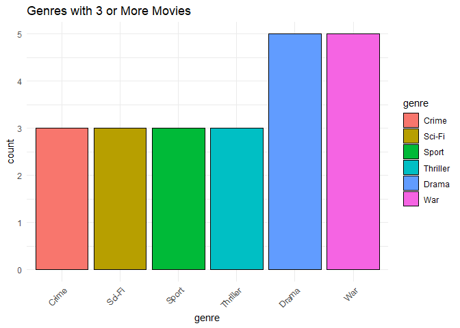

Movie Reviews
================

``` r
library(dplyr)
```

    ## 
    ## Attaching package: 'dplyr'

    ## The following objects are masked from 'package:stats':
    ## 
    ##     filter, lag

    ## The following objects are masked from 'package:base':
    ## 
    ##     intersect, setdiff, setequal, union

``` r
# install.packages("tidyverse")
library(tidyverse)
```

    ## ── Attaching core tidyverse packages ──────────────────────── tidyverse 2.0.0 ──
    ## ✔ forcats   1.0.0     ✔ readr     2.1.4
    ## ✔ ggplot2   3.4.3     ✔ stringr   1.5.0
    ## ✔ lubridate 1.9.2     ✔ tibble    3.2.1
    ## ✔ purrr     1.0.2     ✔ tidyr     1.3.0

    ## ── Conflicts ────────────────────────────────────────── tidyverse_conflicts() ──
    ## ✖ dplyr::filter() masks stats::filter()
    ## ✖ dplyr::lag()    masks stats::lag()
    ## ℹ Use the conflicted package (<http://conflicted.r-lib.org/>) to force all conflicts to become errors

``` r
####What is the top 5 movie genres in the database

my_data <- read.csv("data/movie_genres.csv")

head(my_data)
```

    ##             movie_name      genre release_year
    ## 1     12 Years a Slave Historical         2013
    ## 2                 1917        War         2019
    ## 3                 Argo     Action         2012
    ## 4           The Artist     Comedy         2011
    ## 5 Bend It Like Beckham      Sport         2002
    ## 6        The Big Short  Biography         2015

``` r
top_movies <- my_data %>%
  group_by(genre) %>%
  summarise(movie_count = n()) %>%
  filter(movie_count >= 3)

# view(movie_count)

top_movies <- top_movies %>%
  arrange(desc(movie_count))

# top_movies

top_movies$genre <- reorder(top_movies$genre, top_movies$movie_count)

# install.packages("ggplot2")
library(ggplot2)

ggplot(top_movies, aes(x = genre, y = movie_count, fill = genre)) + 
  geom_bar(stat = "identity", color = "black") +
  labs(title = "Genres with 3 or More Movies", 
       x = "genre",
       y = "count") +
  theme_minimal() +
  theme(axis.text.x = element_text(angle = 45, hjust = 1)
  )
```

<!-- -->
